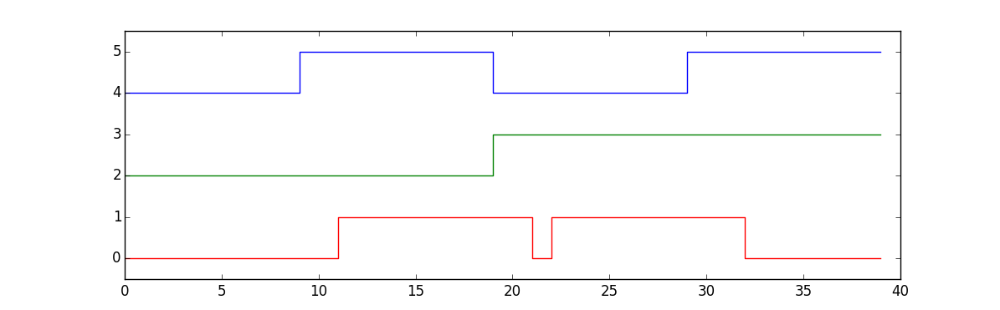

Simple Digital Circuit Simulator
================================

This example application demonstrates how a simple yet functional gate-level
logic circuit simulation SpiNNaker application can be built using Rig.

In this application, each individual gate is modelled by an application core in
SpiNNaker. Connections between the gates are modelled by transmitting multicast
packets. Each core simply recomputes and transmits its value every millisecond
based on the most recently received input values. Some applications may also be
used to playback predefined stimulus signals or record the state of signals as
the simulation progresses.  A simple Rig-based program (`circuit_sim`) runs on
the host taking care of mapping a description of a circuit into applications
and routes, loading and configuring the machine and retrieving results.

Though this example is very simple (and makes incredibly wasteful use of
SpiNNaker's resources), its operation is analogous to the more complex task of
building neural simulation software for SpiNNaker. Just as in many neural
modelling applications we translate a high-level description of a problem into
a graph of application cores connected by routes, map this onto a SpiNNaker
machine and handle basic configuration and result retrieval.

Usage
-----

You'll need to install some Python dependencies before you start:

    pip install rig numpy matplotlib bitarray

Then make sure your board has been booted, e.g.:

    rig-boot spinnaker-board-hostname --spin5

Two example circuits are provided which can be executed using one of:

    python example_xor.py spinnaker-board-hostname
    python example_flipflop.py spinnaker-board-hostname

These scripts describe (at a high level) a circuit and then run a simulation on
an attached SpiNNaker board and then plot the results using matplotlib. The
`example_xor.py` script describes an XOR gate implemented using sum-of-products
and produces a plot which looks like the following where the top two waveforms
are the inputs to the XOR and the bottom waveform is the output.

The `circuit_sim.py` file contains the full Rig-based program which maps the
high level circuit description onto a SpiNNaker board and runs the model. This
module has a set of complementary tests which demonstrate how to test host-side
applications without the need for a SpiNNaker board to be present. The test
suite's dependencies can be installed and the tests executed using:

    pip install pytest mock
    py.test test_circuit_sim.py

The `spinnaker_applications` directory contains the C sources and compiled
binaries for the SpiNNaker applications which implement the SpiNNaker-side of
the simulation. See the subsection below for details of how to recompile these
applications.

SpiNNaker Binary Compilation
----------------------------

Precompiled binaries are included in the repository so you don't need to
compile the binaries in order to play with the program as it stands. If you
want to compile the SpiNNaker binaries, after sourcing the setup script in the
official spinnaker low-level software release, execute the following quick-hack
snippet:

    cd spinnaker_applications
    for f in *.c; do
        make APP=${f%.c} clean; make APP=${f%.c};
    done

