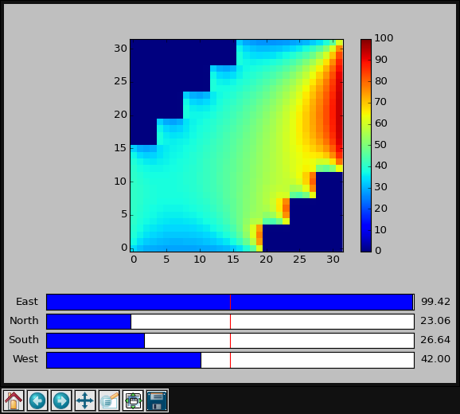

Heat Diffusion Model
====================

This application uses SpiNNaker to model heat diffusion in a 2D surface and
demonstrates how data can be extracted from SpiNNaker and plotted
interactively.

Each SpiNNaker core models a single square fragment of the 2D surface. Every
1ms, cores multicast their current temperature to their immediate neighbours in
2D space and update their own temperatures according to the reported
temperatures of the cores around them. Every 64 ms, every chip reports the
current temperature of all cores on its chip back to the host in an SDP packet.
The application also listens for SDP packets which allow the host to set the
temperature of the periphery of the simulation.

The host application is responsible for loading the SpiNNaker application,
generating appropriate multicast routes, plotting the temperatures received
from the machine and allowing the user to set the temperature of the boarders
of the machine.

`Source code on GitHub
<https://github.com/project-rig/rig_examples/tree/master/heat_diffusion>`_

Usage
-----

You'll need to install some Python dependencies before you start::

    $ pip install rig numpy matplotlib

Then make sure your board has been booted, e.g.::

    $ rig-boot spinnaker-board-hostname --spin5

You can then start the example using::
    
    $ python run.py spinnaker-board-hostname

Or if you want to specify your own constant of diffusivity::

    $ python run.py spinnaker-board-hostname 0.5

Once the application has been loaded, a GUI should launch in which looks like
the screenshot below (taken using a single SpiNN-5 board). Click on the sliders
to adjust the temperature around the periphery of the model. Closing the window
will stop the application runnning.

SpiNNaker Binary Compilation
----------------------------

Precompiled binaries are included in the repository so you don't need to
compile the binaries in order to play with the program as it stands. If you
want to compile the SpiNNaker binaries, after sourcing the setup script in the
official spinnaker low-level software release simply compile ``heat.c`` as
usual::

    make APP=heat

